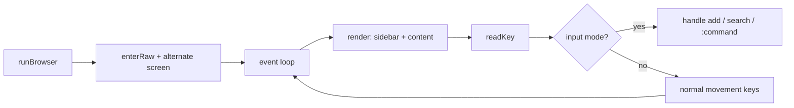

# TUI systems

`notie` ships three custom terminal UIs. They share a single raw-mode terminal stack and similar vim-inspired keybindings.

## Shared infrastructure

Raw mode is implemented in [`term.go`](term.go) using direct Darwin `ioctl` syscalls:

- `enterRaw` saves the current `termios` and disables echo, canonical mode, signals, and some input processing.
- `restoreTerm` restores the saved state.
- `readKey` reads one keypress and translates arrow/page escape sequences into vim-style keys (`j`, `k`, `ctrl-u`, `ctrl-d`).

Every TUI enables the alternate screen (`\x1b[?1049h`) and hides the cursor on entry, then restores both on exit. If raw mode cannot be entered, each TUI falls back to plain-text output.

## Day browser (`tui_browser.go`)

The day browser is reused for `notie journal`, `notie shell`, and `notie important`. It shows a dates sidebar on the left and the selected day's entries on the right.

A `browserCfg` adapts the generic `browserTUI` to each data source:

- `dates()` returns days that have content.
- `dayLines(d)` returns the raw lines for that day.
- `add(d, text)` writes to the selected day (nil disables `a`).
- `summaries()` supplies optional `datecache.md` one-liners.

Key bindings:

| Key | Action |
|-----|--------|
| `j` / `k` | Next / previous day |
| `J` / `K` | Scroll content down / up |
| `gg` / `G` | First / last day |
| `ctrl-d` / `ctrl-u` | Half-page content scroll |
| `t` | Jump to today |
| `a` / `o` | Add to selected day (journal/important only) |
| `/` | Search dates and content |
| `:ff <pat>` | Live-find dates |
| `:fg <pat>` | Grep content |
| `n` / `N` | Next / previous match |
| `q` / `:q` | Quit |

`importantBrowser` is special: `important.md` is flat and append-only, so `a` always writes to today regardless of the selected day.

## Task list (`tui_task.go`)

The task TUI displays open tasks grouped by priority, hiding done tasks by default.

Key bindings:

| Key | Action |
|-----|--------|
| `j` / `k` | Move cursor |
| `gg` / `G` | Top / bottom |
| `x` / `space` | Toggle done / open |
| `0` / `1` / `2` | Set priority |
| `.` | Show/hide done tasks |
| `dd` | Delete task |
| `a` / `o` | Add task (`<0\|1\|2> text`) |
| `/` | Search tasks |
| `:fg <pat>` | Grep tasks |
| `n` / `N` | Next / previous match |
| `q` / `:q` | Quit |

`toggle` rewrites the checkbox and stamps or removes the ` (done YYYY-MM-DD)` suffix. `setPri` rewrites the priority marker and re-sorts the list, moving the cursor with the task.

## Notes list (`tui_notes.go`)

A simpler list TUI used for `notie remember` and, with the right `notesCfg`, could power other flat note files. It shows one item per `- ...` line, supports add/delete/search, and uses the same rendering helpers as the other TUIs.

Current configs:

- `rememberCfg` for `remember.md` with a diamond icon and magenta color.

## Rendering helpers (`theme.go`)

[`theme.go`](theme.go) holds the ANSI color palette, unicode icons, and small text utilities:

- `runeLen`, `truncRunes`, `padTo`, `wrapRunes` for display-width-aware text layout.
- `highlight` for search-match styling.
- `titleBar` and `cursorRow` for consistent chrome.

Icons are standard unicode glyphs; no Nerd Font is required.

## TTY detection

`isTTY` in [`term.go`](term.go) checks that stdin and stdout are character devices and that `TIOCGETA` succeeds. Non-TTY invocations fall back to plain output commands (`cmdShow`, `printTasks`, etc.).
